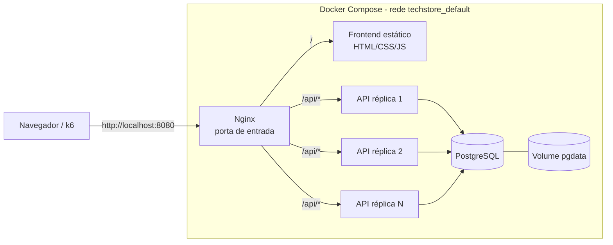
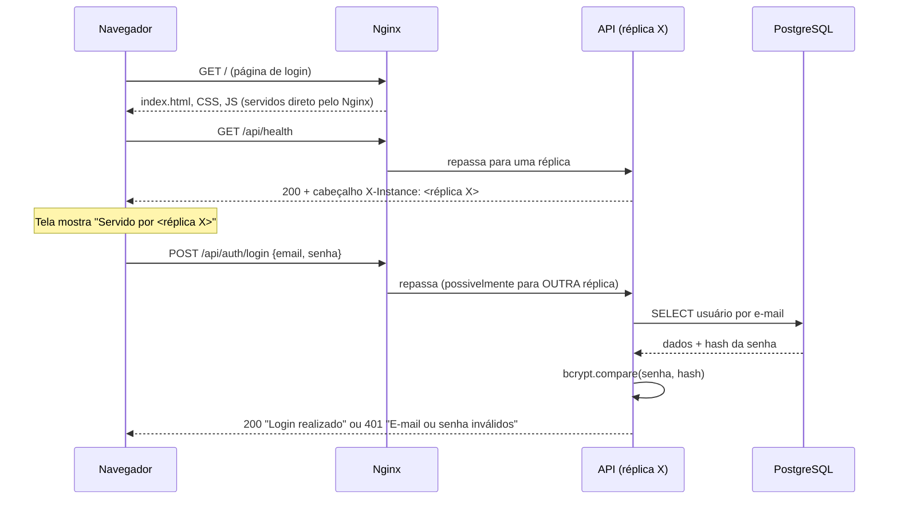
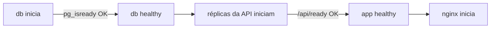
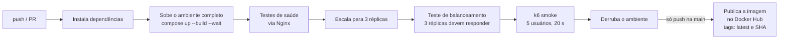

# TechStore — Como o sistema funciona hoje

> Este documento descreve o **estado atual** do projeto da Problemática 02 (Crescimento e Escalabilidade): o que existe, como cada peça funciona e como elas se comunicam.
> **Importante:** a solução atual usa **Docker Compose**. O Kubernetes **ainda não é usado**; ele está planejado como evolução.

---

## 1. Visão geral

A TechStore roda como um conjunto de containers na mesma máquina, orquestrados pelo Docker Compose:



| Serviço | Imagem | Quantidade | Acessível de fora? |
|---|---|---|---|
| `nginx` | `nginx:1.27-alpine` | 1 | ✅ Sim, porta **8080** (configurável) |
| `app` (API) | `techstore-api:local` (construída do `backend/`) | **2 por padrão**, escalável | ❌ Não, só pela rede interna |
| `db` | `postgres:16-alpine` | 1 | ❌ Não, só pela rede interna |

A ideia central é que **a API não guarda nenhum dado dentro do container**. Todo dado vai para o PostgreSQL. Por isso, qualquer réplica pode atender qualquer requisição, e dá para ter quantas réplicas forem necessárias.

---

## 2. O caminho de uma requisição

Exemplo: um usuário faz login pela tela da TechStore.



1. **O Nginx recebe tudo na porta 8080.** Caminhos comuns (`/`, `/css/...`, `/js/...`) são servidos direto da pasta `frontend/`. Caminhos que começam com `/api/` são encaminhados para a API.
2. **O Nginx escolhe uma réplica** alternando entre elas (round-robin).
3. **A réplica consulta o PostgreSQL.** Como todas usam o mesmo banco, um cadastro feito numa réplica funciona para login em qualquer outra.
4. **Toda resposta leva o cabeçalho `X-Instance`** com o nome do container que respondeu. A tela de login exibe esse nome em "Servido por".

---

## 3. Os componentes em detalhe

### 3.1 Nginx: porta de entrada e balanceador (`nginx/nginx.conf`)

- **Descoberta dinâmica de réplicas.** O Nginx usa o DNS interno do Docker (`resolver 127.0.0.11 valid=5s`) e reconsulta o nome `app` a cada 5 segundos. Quando réplicas são criadas ou removidas com `--scale`, elas entram ou saem do balanceamento **sem reiniciar o Nginx**.
- **Tolerância a falhas.** Se uma réplica cair ou não responder (`error`, `timeout`, `502`, `503`), o Nginx reenvia a requisição para outra réplica (`proxy_next_upstream`). Nos testes, uma réplica foi derrubada durante a carga e nenhuma requisição falhou.
- **Log de balanceamento.** Cada linha do log mostra qual réplica atendeu (`upstream=IP:porta`) e o tempo de resposta. Para ver: `docker compose logs -f nginx`.

### 3.2 API: Node.js + Express (`backend/`)

| Endpoint | Função |
|---|---|
| `GET /api/health` | **Liveness:** o processo está de pé? Retorna `instance` (nome do container) |
| `GET /api/ready` | **Readiness:** a réplica consegue atender? Testa a conexão com o banco (`SELECT 1`) |
| `POST /api/auth/register` | Cadastra usuário (valida nome, e-mail e senha ≥ 6; senha com hash bcrypt) |
| `POST /api/auth/login` | Valida e-mail e senha e devolve um **token JWT** |
| `GET /api/auth/me` 🔒 | Dados do usuário logado |
| `GET /api/products` | Lista produtos |
| `POST /api/products` 🔒 | Cria produto (valida nome, preço ≥ 0, estoque inteiro ≥ 0) |
| `PUT /api/products/:id` 🔒 | Atualiza só os campos enviados |
| `DELETE /api/products/:id` 🔒 | Remove produto |

🔒 = exige `Authorization: Bearer <token>`. O token é um **JWT** assinado com `JWT_SECRET`, a mesma em todas as réplicas: qualquer réplica valida o token sozinha, sem sessão em memória. Por isso o login não quebra quando o Nginx troca de réplica.

**Como a API se comporta dentro do Docker:**

- **Imagem** `node:22-slim` em dois estágios: o primeiro instala as dependências e o segundo monta a imagem final. O container roda como usuário **não-root**.
- **Limites por réplica:** **0,5 CPU e 256 MB**. Isso simula servidores pequenos e faz o ganho de escalar aparecer nos testes.
- **Conexões com o banco:** cada réplica mantém um pool de até **10 conexões** (`DB_POOL_MAX`).
- **Healthcheck:** a cada 10 s, o Docker chama o `/api/ready`. Uma réplica só é marcada como *healthy* quando consegue falar com o banco.
- **Desligamento gracioso:** quando uma réplica é removida (*scale down*), o Docker envia `SIGTERM`. A API para de aceitar novas conexões, termina as requisições em andamento, fecha o pool do banco e sai. Se isso passar de 10 s, ela é encerrada à força.

**Regras garantidas pelo banco,** e não pelo código, o que funciona mesmo com várias réplicas ao mesmo tempo:
- **IDs sempre únicos** (`SERIAL`): 20 cadastros simultâneos em réplicas diferentes geraram 20 IDs distintos.
- **E-mail único** (`UNIQUE`): se duas réplicas tentarem cadastrar o mesmo e-mail ao mesmo tempo, uma recebe `201` e a outra `400`.

### 3.3 PostgreSQL (`db/init.sql`)

- **Tabelas** `users` e `products`, criadas pelo `init.sql`, com os dados iniciais (seed) migrados dos antigos arquivos JSON.
- **O `init.sql` só roda na primeira subida,** quando o volume está vazio. Nas subidas seguintes, o banco reaproveita os dados existentes.
- **Os dados ficam no volume `pgdata`.** Eles sobrevivem a `docker compose down`, a reinícios e à recriação dos containers. Só são apagados com `docker compose down -v`.
- **A porta 5432 não é exposta para fora;** só os containers da rede interna acessam o banco.

### 3.4 Frontend (`frontend/`)

- **Telas:** login (`index.html`), criar conta (`cadastro.html`) e painel após o login (`painel.html`, com nome do usuário, produtos e botão Sair).
- **Sessão:** o token JWT fica no navegador e vai em cada chamada à API; um `401` apaga o token e volta para o login.
- **No painel, "Réplicas que validaram seu login"** lista cada réplica que aceitou o mesmo token.

- Tela de login em HTML, CSS e JavaScript puro, servida pelo Nginx.
- **`js/api.js`:** usa `/api` quando a página vem do Nginx e `http://localhost:8080/api` quando é aberta pelo Live Server do VS Code (porta 5500). Assim dá para editar o visual com o Docker rodando.
- **Login real contra a API.** "Manter conectado" guarda o usuário no `localStorage`; sem essa opção, no `sessionStorage`.
- **"Servido por"** mostra qual réplica atendeu a última requisição. Recarregue a página e o nome muda.

---

## 4. Ordem de inicialização

O Compose sobe os serviços respeitando os healthchecks:



Isso evita dois problemas comuns: a API tentar conectar num banco que ainda não está pronto, e o Nginx receber tráfego antes de haver réplicas saudáveis.

---

## 5. Como a escala funciona hoje

### 5.1 Escala manual (o que foi medido)

```powershell
docker compose up -d --no-recreate --scale app=5    # aumenta para 5
docker compose up -d --no-recreate --scale app=2    # reduz para 2
```

- **Para aumentar:** o Compose cria as novas réplicas, espera o healthcheck e, em até 5 s, o Nginx passa a enviar tráfego para elas.
- **Para reduzir:** as réplicas removidas recebem `SIGTERM` e saem de forma graciosa.
- **O `--no-recreate`** garante que as réplicas existentes não sejam reiniciadas.

### 5.2 Autoscaling simulado (`scripts/autoscale.sh`)

O Docker Compose **não faz autoscaling sozinho**. O script imita o que um orquestrador faria:

```
a cada 10 s:
  mede a CPU média das réplicas (docker stats)
  se CPU > 35% e réplicas < 5  → sobe uma réplica e espera 30 s (cooldown)
  se CPU < 10% e réplicas > 2  → remove uma réplica e espera 30 s
```

Todos os valores podem ser mudados por variável de ambiente, por exemplo `SCALE_UP_CPU=25 ./scripts/autoscale.sh`. O script roda no Git Bash (Windows), no Linux ou no Mac.

> ⚠️ **Status:** o script está pronto e com a sintaxe validada, mas **ainda não foi demonstrado rodando** com carga real.

### 5.3 Resultados medidos (k6, pico de 50 usuários simultâneos)

| Réplicas | Latência p95 | Latência média | Vazão | Erros reais |
|---|---|---|---|---|
| 2 | 2,73 s ❌ (meta: < 2 s) | 479 ms | 28,5 req/s | 0% |
| 5 | 775 ms ✅ | 155 ms | 42,6 req/s | 0% |

**Com 5 réplicas, a latência p95 caiu 72% e a vazão subiu 49%.** O motivo: com 2 réplicas, a API inteira tem 1 CPU (2 × 0,5), e o bcrypt do login consome muita CPU. Com 5, são 2,5 CPUs.

---

## 6. Configuração do ambiente (`.env`)

Tudo que muda entre ambientes fica no `.env`, criado a partir do `.env.example`. O `.env` **nunca vai para o Git**, porque o `.gitignore` o bloqueia.

| Variável | Padrão | Para que serve |
|---|---|---|
| `HTTP_PORT` | `8080` | Porta pública do Nginx |
| `APP_REPLICAS` | `2` | Número inicial de réplicas da API |
| `APP_IMAGE` | `techstore-api:local` | Imagem da API (local ou do Docker Hub) |
| `APP_CPU_LIMIT` / `APP_MEM_LIMIT` | `0.5` / `256M` | Limites por réplica |
| `DB_USER` / `DB_PASSWORD` / `DB_NAME` | — | Credenciais do banco (**`DB_PASSWORD` é obrigatória**; sem ela, o compose não sobe) |
| `DB_POOL_MAX` | `10` | Conexões por réplica |
| `JWT_SECRET` | — | Chave que assina os tokens de login (**obrigatória e igual em todas as réplicas**) |
| `JWT_EXPIRES_IN` | `2h` | Validade do token |

---

## 7. Pipeline CI/CD (`.github/workflows/ci.yml`)

Dispara em **push na `main`** e em **pull request para a `main`**.



- **Se qualquer etapa falhar,** o pipeline para, mostra os logs dos containers e **a imagem não é publicada**.
- **Em pull requests,** só o job de testes roda; a publicação acontece depois do merge na `main`.
- **A publicação precisa dos secrets** `DOCKERHUB_USERNAME` e `DOCKERHUB_TOKEN`.

> ⚠️ **Status:** o workflow foi validado com o `actionlint`, mas **ainda não rodou no GitHub**. Está aguardando o push para o repositório da equipe.

---

## 8. Estrutura do projeto

```
techstore-devops16-labs/
├── .github/workflows/ci.yml     # pipeline CI/CD
├── backend/
│   ├── Dockerfile               # imagem da API
│   ├── db.js                    # conexão com o PostgreSQL (pool)
│   ├── app.js / server.js       # Express, X-Instance, desligamento gracioso
│   ├── controllers/ services/ routes/
│   └── tests/                   # health.test.js, loadbalance.test.js
├── db/init.sql                  # schema + dados iniciais
├── docker-compose.yml           # ambiente completo
├── nginx/nginx.conf             # balanceador + frontend
├── frontend/                    # tela de login
├── loadtest/load-test.js        # teste de carga (k6)
├── scripts/autoscale.sh         # autoscaling simulado
├── docs/PROBLEMATICA-02.md      # documentação da solução
├── .env.example                 # modelo de configuração
├── .gitignore / .gitattributes  # proteção do .env e LF nos scripts
└── README.md
```

---

## 9. Comandos do dia a dia

```powershell
# Primeira vez
copy .env.example .env                 # e trocar o DB_PASSWORD

# Subir / ver estado / derrubar
docker compose up -d --build
docker compose ps
docker compose down                    # mantém os dados
docker compose down -v                 # apaga também o banco

# Logs
docker compose logs -f nginx           # qual réplica atendeu cada requisição
docker compose logs -f app             # logs de todas as réplicas

# Escalar
docker compose up -d --no-recreate --scale app=5

# Teste de carga
docker run --rm --network techstore_default -e BASE_URL=http://nginx `
  -v "${PWD}/loadtest:/scripts" grafana/k6 run /scripts/load-test.js

# Testes automatizados (precisa de Node no Windows)
cd backend; npm ci
$env:API_URL="http://localhost:8080"; npm test
$env:EXPECTED_INSTANCES=2; npm run test:lb
```

---

## 10. O que o sistema **ainda não** faz

| Item | Situação atual |
|---|---|
| **Kubernetes** | Não é usado. Planejado como evolução (HPA, autocura, rolling update) |
| **Autoscaling real** | Simulado por script, e **ainda não demonstrado rodando** |
| **Várias máquinas** | Tudo roda num único computador |
| **Alta disponibilidade do banco** | O PostgreSQL é único: se cair, a API para. Limite conhecido: com 10 réplicas × 10 conexões = 100 conexões, chega-se ao máximo padrão do PostgreSQL |
| **Deploy automático** | O pipeline publica a imagem, mas atualizar o ambiente é manual (`docker compose pull` + `up -d`) |
| **Atualização sem ficar fora do ar** | O `docker compose up -d` recria as réplicas juntas |
| **Backup automático** | Não existe; os dados dependem só do volume |
| **Recuperação de senha** | "Esqueci minha senha" ainda não existe (exigiria envio de e-mail) |
| **Perfis de acesso** | Qualquer usuário logado pode criar, editar e apagar produtos (não há papel de administrador) |

---

## 11. Onde cada parte foi validada

| O quê | Onde | Resultado |
|---|---|---|
| Compose, Dockerfile, workflow | Validadores oficiais (`docker compose config`, `hadolint`, `actionlint`) | ✅ Sem erros |
| Consistência entre réplicas, IDs e e-mail únicos | Simulação com 3 réplicas + PostgreSQL | ✅ |
| Queda de réplica durante a carga | Simulação com 3 réplicas + Nginx | ✅ 0 erros |
| Subida completa e escala 2 → 5 | Docker Desktop (Windows) | ✅ Todos healthy |
| Teste de carga 2 × 5 réplicas | Docker Desktop (Windows) | ✅ Números da seção 5.3 |
| Autoscaling por script | — | ⏳ Pendente |
| Pipeline no GitHub | — | ⏳ Pendente (aguardando push) |
