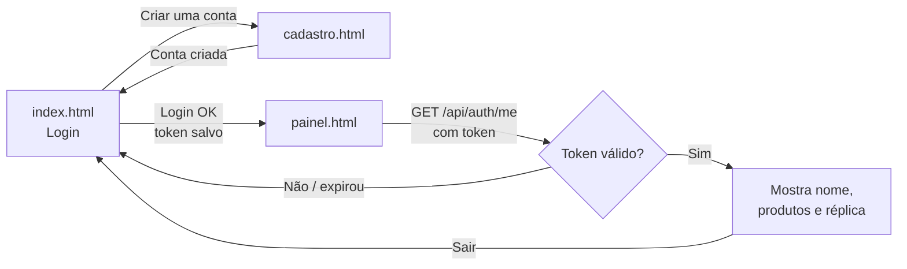

# Tarefas — Criar conta, login com sessão e página após o login

> **Objetivo:** fazer o fluxo completo do usuário funcionar na TechStore: **criar conta → entrar → ver uma página logada → sair**.
> **Branch sugerida:** `feature/autenticacao` · entra na `main` por PR, com o check `Build e testes` verde.

---

## Situação atual

| Item | Situação |
|---|---|
| Cadastro na API (`POST /api/auth/register`) | ✅ Existe (senha com bcrypt, e-mail único garantido pelo banco) |
| Login na API (`POST /api/auth/login`) | ✅ Existe (confere a senha no PostgreSQL) |
| Tela de login | ✅ Funciona, mas só mostra "Bem-vindo" e continua na mesma página |
| Tela de cadastro ("Criar uma conta") | ❌ Link sem função |
| Sessão / token | ❌ A API não "lembra" que o usuário entrou |
| Página após o login | ❌ Não existe |
| Proteção das rotas de produtos | ❌ Criar, editar e apagar funcionam sem login |
| "Esqueci minha senha" | ❌ Fora do escopo (ver o fim do documento) |

---

## Decisão técnica importante: token JWT, não sessão em memória

A API roda em **várias réplicas**. Uma sessão guardada na memória do processo (ex.: `express-session` padrão) **quebraria o sistema**: o usuário entraria pela réplica 1 e, na próxima requisição, o Nginx poderia mandá-lo para a réplica 2, que não conhece a sessão.

Com **JWT**, o próprio token carrega quem é o usuário, assinado com uma chave secreta. **Qualquer réplica valida o token sozinha**, sem consultar as outras. A aplicação continua *stateless*, que é a base da solução da Problemática 02.

> ⚠️ **Condição obrigatória:** todas as réplicas precisam usar **a mesma** `JWT_SECRET`. Ela vem do `.env`, nunca do código.

---

## Fase 1 — Backend: token JWT

- [ ] Instalar a dependência: `cd backend && npm install jsonwebtoken`
- [ ] Adicionar as variáveis no `.env.example` (raiz) e no `backend/.env.example`:
  ```
  JWT_SECRET=troque-esta-chave-por-uma-longa-e-aleatoria
  JWT_EXPIRES_IN=2h
  ```
- [ ] Passar as variáveis para o serviço `app` no `docker-compose.yml`:
  ```yaml
  JWT_SECRET: ${JWT_SECRET:?Defina JWT_SECRET no .env}
  JWT_EXPIRES_IN: ${JWT_EXPIRES_IN:-2h}
  ```
- [ ] `authService.login`: gerar o token com `{ id, email, role }` e devolver `{ token, user }`
- [ ] Criar `backend/middlewares/auth.js`:
  - lê o cabeçalho `Authorization: Bearer <token>`
  - token válido → coloca o usuário em `req.user` e segue
  - sem token ou inválido/expirado → `401 { message: "Não autenticado." }`
- [ ] Criar a rota `GET /api/auth/me` (protegida): devolve os dados do usuário logado
- [ ] Validar o cadastro no `authService.register`:
  - [ ] e-mail em formato válido
  - [ ] senha com no mínimo 6 caracteres
  - [ ] nome não vazio

**Critério de aceite:** `POST /api/auth/login` devolve um `token`; `GET /api/auth/me` com esse token devolve o usuário em **qualquer réplica**; sem token, devolve `401`.

---

## Fase 2 — Frontend: tela "Criar conta"

- [ ] Criar `frontend/cadastro.html` com o mesmo visual do login (reaproveitar `css/style.css`):
  - campos: **Nome**, **E-mail**, **Senha**, **Confirmar senha**
  - link "Já tem conta? Entrar" → `index.html`
- [ ] Criar `frontend/js/cadastro.js`:
  - [ ] validar no navegador: campos preenchidos, e-mail válido, senha ≥ 6, senhas iguais
  - [ ] chamar `api.register(nome, email, senha)` (já existe no `api.js`)
  - [ ] sucesso → redirecionar para `index.html?cadastro=ok`
  - [ ] erro → mostrar a mensagem da API (ex.: "E-mail já cadastrado.")
- [ ] No `index.html`, ligar o link "Criar uma conta" a `cadastro.html`
- [ ] No `main.js`, se a URL tiver `?cadastro=ok`, mostrar "Conta criada! Entre com seu e-mail e senha."

**Critério de aceite:** criar uma conta pela tela, ver a mensagem de sucesso no login e conseguir entrar com ela.

---

## Fase 3 — Frontend: login com redirecionamento

- [ ] `main.js`: depois do login, salvar o **token** e o **usuário**
  - "Manter conectado" marcado → `localStorage`
  - desmarcado → `sessionStorage`
  - chaves sugeridas: `techstore:token` e `techstore:user`
- [ ] Redirecionar para `painel.html` após o login
- [ ] Se o usuário abrir `index.html` já logado (token salvo), ir direto para o `painel.html`
- [ ] `api.js`: enviar `Authorization: Bearer <token>` automaticamente quando houver token
- [ ] `api.js`: se qualquer resposta vier `401`, apagar o token e voltar para `index.html`

**Critério de aceite:** entrar leva ao painel; fechar e reabrir o navegador mantém o login só se "Manter conectado" estiver marcado.

---

## Fase 4 — Página após o login (`painel.html`)

- [ ] Criar `frontend/painel.html` com o visual da TechStore
- [ ] **Proteção da página:** ao carregar, chamar `GET /api/auth/me`
  - sem token ou `401` → redirecionar para `index.html`
- [ ] Cabeçalho com: logo, **"Olá, [nome]"** e botão **Sair**
- [ ] **Lista de produtos** (usar o `js/products.js`, hoje vazio): nome, descrição, preço formatado em R$ e estoque, vindos de `GET /api/products`
- [ ] Manter o **"Servido por [réplica]"** no rodapé, para a demonstração do balanceamento continuar funcionando
- [ ] Botão **Sair:** apaga o token e o usuário do navegador e volta para `index.html`

**Critério de aceite:** após o login, o painel mostra o nome do usuário e os produtos; recarregar a página várias vezes alterna o "Servido por" **sem deslogar** (prova de que o token funciona em todas as réplicas).

---

## Fase 5 — Proteger as rotas de produtos

- [ ] Aplicar o middleware `auth` em `POST`, `PUT` e `DELETE /api/products`
- [ ] Manter `GET /api/products` **público** (o teste de carga e o `health.test.js` usam essa rota)
- [ ] *(Opcional)* Exigir `role: "admin"` para criar, editar e apagar, e criar um usuário admin no `db/init.sql`

**Critério de aceite:** criar um produto sem token devolve `401`; com token, devolve `201`.

---

## Fase 6 — Testes e pipeline

- [ ] Criar `backend/tests/auth.test.js` cobrindo:
  - [ ] cadastro de um usuário novo → `201`
  - [ ] cadastro com e-mail repetido → `400`
  - [ ] login correto → `200` com `token`
  - [ ] login com senha errada → `401`
  - [ ] `GET /api/auth/me` com token → `200`; sem token → `401`
  - [ ] **token gerado numa réplica aceito pelas outras** (várias chamadas ao `/me` pelo Nginx, conferindo o `X-Instance`)
- [ ] Adicionar o script `"test:auth"` no `package.json`
- [ ] No `.github/workflows/ci.yml`, rodar `npm run test:auth` depois do teste de saúde
- [ ] Conferir que o pipeline continua funcionando: o `.env.example` precisa ter `JWT_SECRET`, porque o CI faz `cp .env.example .env`
- [ ] Rodar o teste de carga de novo e confirmar que **o desempenho não piorou** (o login passa a gerar um token, um custo pequeno perto do bcrypt)

**Critério de aceite:** pipeline verde no PR com os testes novos.

---

## Fase 7 — Documentação e apresentação

- [ ] Atualizar `frontend/README.md` (novas telas e fluxo)
- [ ] Atualizar `docs/COMO-FUNCIONA.md`: tabela de endpoints (`/api/auth/me`), fluxo de login com JWT e a variável `JWT_SECRET`
- [ ] Atualizar o slide "Onde estamos" e a seção de limitações (remover "sem sessão" e "rotas de produtos sem proteção")
- [ ] Preparar a fala para a banca: **por que JWT e não sessão em memória** (ver a decisão técnica acima)

---

## Fluxo final esperado



---

## Ordem sugerida e divisão

| # | Fase | Depende de | Responsável | Prazo |
|---|---|---|---|---|
| 1 | Backend: JWT | — | | |
| 2 | Tela de cadastro | — (pode ser em paralelo com a 1) | | |
| 3 | Login com redirecionamento | 1 | | |
| 4 | Página do painel | 1 e 3 | | |
| 5 | Proteção das rotas | 1 | | |
| 6 | Testes e pipeline | 1 a 5 | | |
| 7 | Documentação | 1 a 6 | | |

**Versionamento:** ao fazer o merge, criar a tag **`v2.1.0`** na `main`. O Kubernetes, que estava planejado como `v2.1.0`, passa a ser **`v2.2.0`**.

---

## Fora do escopo (por enquanto)

| Item | Motivo |
|---|---|
| "Esqueci minha senha" | Exige envio de e-mail (servidor SMTP, token de recuperação com validade). Manter o link mostrando "em breve" |
| Renovação automática do token (*refresh token*) | Com validade de 2h, basta entrar de novo; para o MVP, não é necessário |
| Login com Google/GitHub | Não tem relação com a Problemática 02 |
